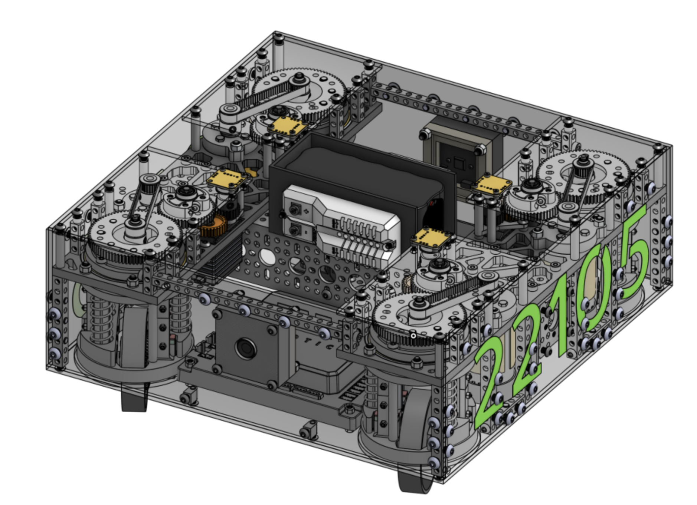
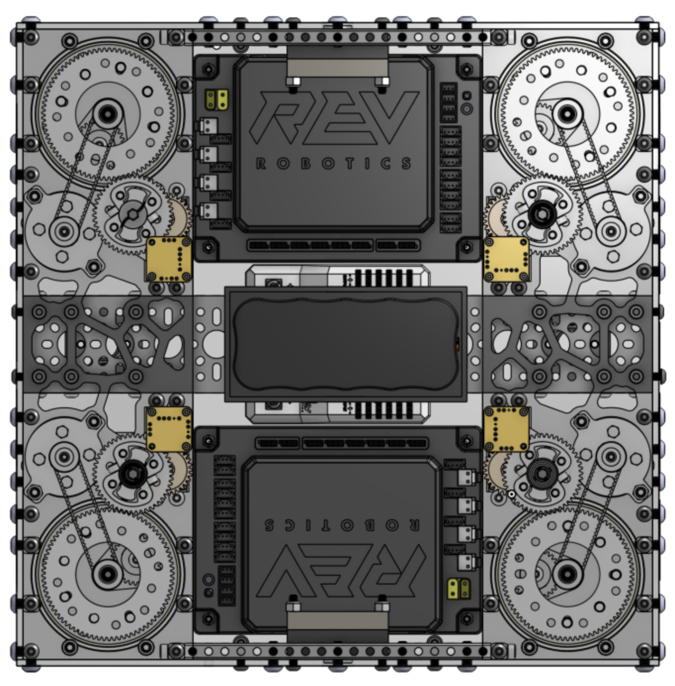
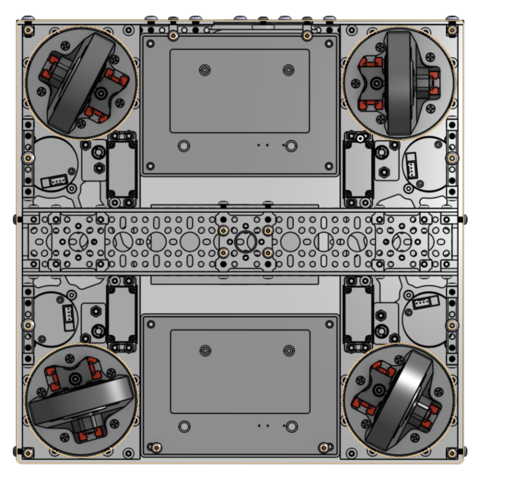
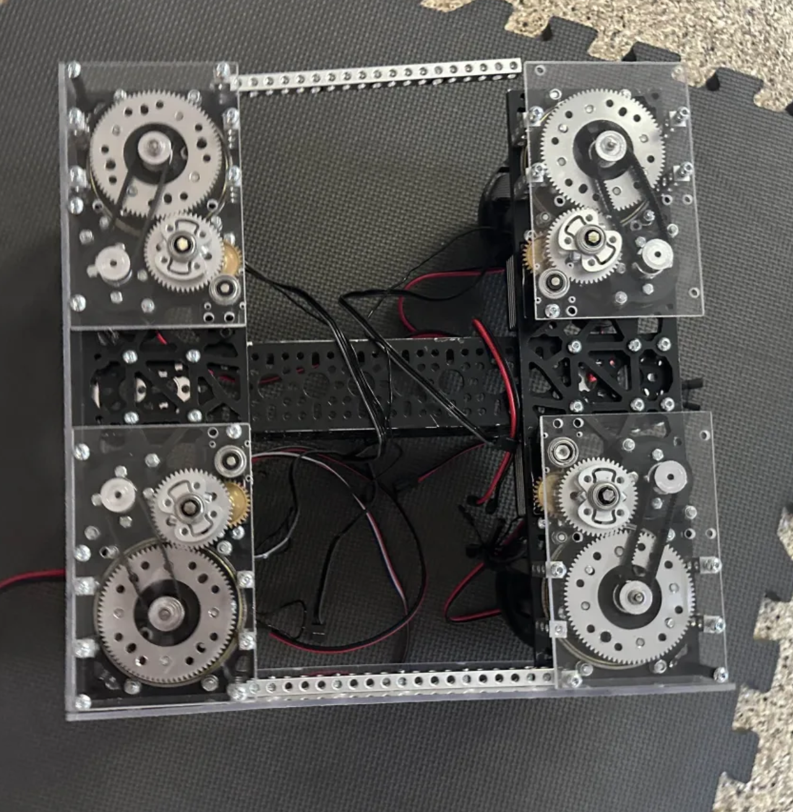
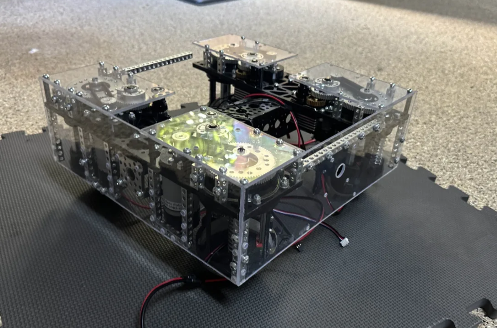
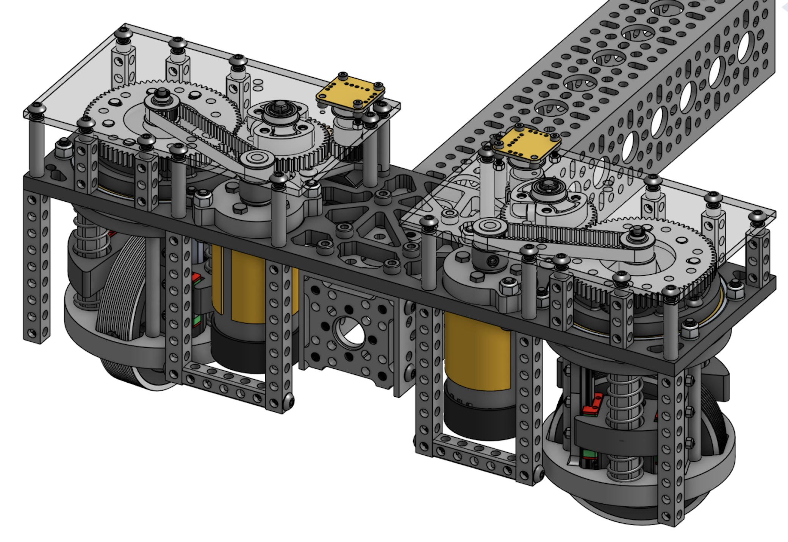
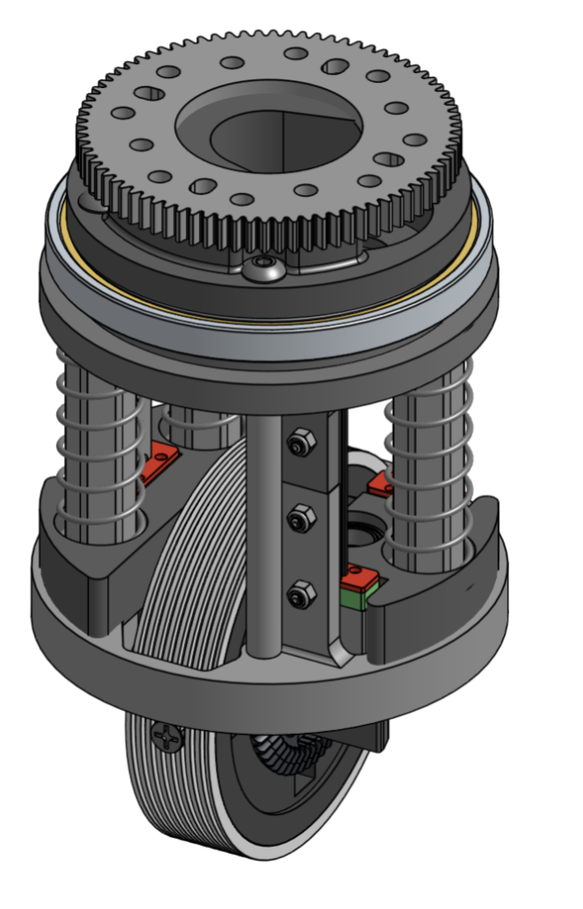
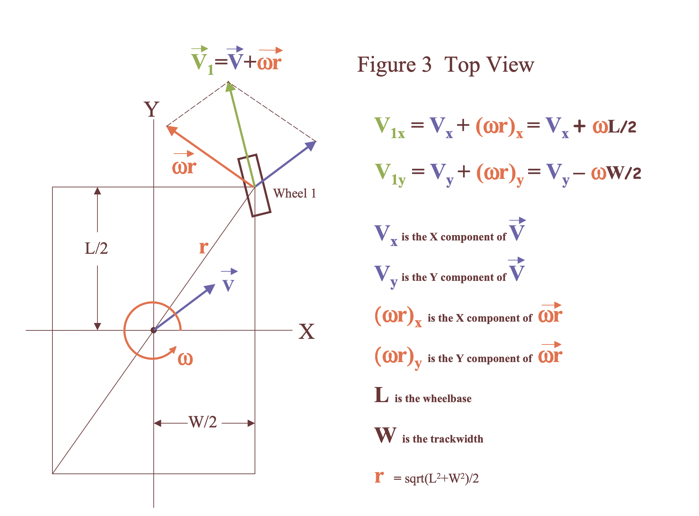

# FTC Independent Suspension Coaxial Swerve Drive

Welcome to the project page for the **FTC Independent Suspension Coaxial Swerve Drive**! This project, developed by FIRST TECH CHALLENGE Team #22105 Runtime Terror, is the FIRST (pun intended 😉) ever FIRST drivetrain with three degrees of freedom: each wheel can independently rotate on the pitch and yaw axis while also moving up and down. FTC Swerves have only been created by less than 50 teams, and a suspension version has never been done in FTC or FRC.

This unique drivetrain allows for full maneuvaribility in all directions, while maintaining full power unlike a Mecanum drive. The suspension allows for easy travel over rough terrain (our prediction for the Into the Deep FTC season), and consistent odometry tracking.

---

## Demonstrating the robot-- Suspension & Holonomic Movement!

*Demonstrating the robots maneuvaribility in all directions*

*Traveling over terrain while maintaining horizontal chassis*

---

## Robot & Onshape CAD Images

Below are some images that showcase the design and functionality of the swerve drive system:

---

## Project Overview

The FTC Independent Suspension Coaxial Swerve Drive is a state-of-the-art swerve drive system designed for FTC robotics competitions. It features an independent suspension mechanism and one motor to control the rotation of the wheel and an Axon Max+ Servo to control the rotation of the pod. This project highlights the complex mechanical design and software control involved with the creation of this drivetrain.

We spent over 300 hours CAD'ing it on Onshape, and then another ~200 hours to program the kinematics and control system for the robot, with around another 100 collective hours of testing it, leading to a total of around 600 hours amongst our team. I was involved in all sections for this (Rahul Verma), and around 350 of these hours came from me. This project was completed in the entirety of the summer.

---

## How It Works

## Mechanical Design

This section includes a detailed overview of the mechanical aspects of the swerve drive system. 

### Coaxial Drive
Coaxial swerve drive involves 2 actuators (in our case, a motor and a servo) powering two inline axis respectively. There is a center gear that transmits power to an orbiting gear, which then redirects the power to the wheel with a set of Bevel gears.

The servos rotate the pod by rotating the entire mechanism housed in a X-Contact bearing, which provides superior strength and durability compared to standard radial bearings for primarily thrust loads.

Due to an effect known as "coaxial effect," when the servo turns, the motor exerts a small yet significant torque on the servo, which can cause delays in response times. Our system has the minimal coaxial effect viable on an FTC robot: 20.45 oz-in.

### Independent Suspension
The entire wheel system rides on a set of multiple MGN7C Linear Rails-- commonly used on 3D Printers. MGN rails provide superior strength (through it's steel usage), stiffness/rigidity, and form factor over standard aluminum slides. These were cut to size on an angle grinder.

We iterated on many different types of springs to use for this situation-- testing 3 different spring rates (3.1 lbs/in, 6.2lbs/in, and 9.3 lbs/in), ultimately deciding on 3.1lbs/in to provide superior suspension.

In the future, we have plans to test out TPU based squishy wheels to provide a basis to absorb the horizontal impact when crossing over terrain.

## Software Control

Here, you’ll get an overview of the software side of the swerve drive system. This section covers the control algorithms and programming techniques used to manage the drive system’s behavior.

### Swerve Kinematics
The most fundamental part of our driving in teleop is changing our desired robot translation into individual velocities for each pod. Based on the offset of each pod from the center of the robot, we can use a series of kinematics equations to convert the velocities from the gamepad joystick into individual pod movement, allowing us to control the swerve with our gamepad controller.

- Credit to Ether's FRC 2011 Paper

### Control Algorithms
We use a PID controller for the desired angle of each of the pods. This generates the power for the servo in each module. We also adjust the power of the motor controlling the wheel in each pod based on how fast it should move.

---

## Acknowledgments

We are extremely grateful to our sponsors in aiding us with this project. This was entirely funded through our sponsors, and this has led us to innovate on such unique designs without harboring the costs.

Sponsors
- Waterjet West
- Qualcomn
- Daves Hot Chicken
- Olive Garden
- Apple

---

## Contact

For more information or questions, please contact Rahul Verma at connect.rahulv@gmail.com or our team at ftcruntimeterror@gmail.com

---

Thank you for exploring the FTC Independent Suspension Coaxial Swerve Drive project. We hope you find it as exciting and innovative as we do, and we appreciate the vote if given one!

